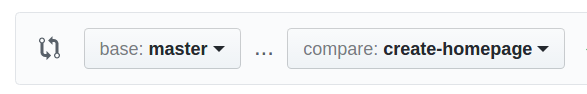
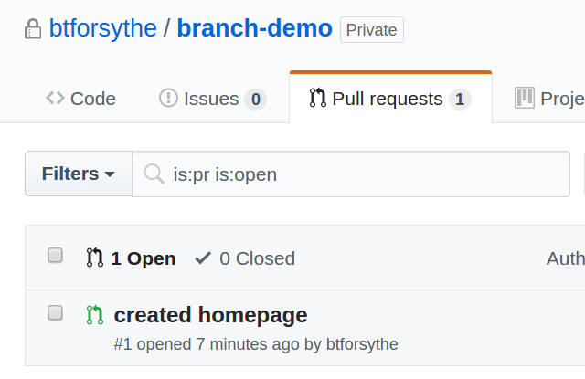

# Feature Branches

When developing software using Git, it's a common practice to create a branch for each new *feature* (story/card/piece of work). Once development on the feature has been completed, this branch is merged, then deleted. The [Understanding the GitHub Flow](https://guides.github.com/introduction/flow/) GitHub Guide gives a good overview of how and why we use branches in this context.

The examples will use work from a Git repository called "branch-demo".

## The process

The process of implementing a feature includes:
- creating a branch
- implementing/committing your work
- incorporating changes made in the master branch
- creating/merging a pull request
- deleting the branch

### Creating a feature branch

At the moment before work begins on a feature, a branch should be created with a name representing the work to be done. In my examples, I'll create a branch called "create-homepage".

First (as we should frequently), we verify status:

```bash
brian@Fafhrd:~/demo/branch-demo$ git status
On branch master

Initial commit

nothing to commit (create/copy files and use "git add" to track)
brian@Fafhrd:~/demo/branch-demo$
```

Now we need to create a branch and check it out (point HEAD at the branch, so changes will be committed to the branch). (Note: you will not be able to create a branch until something has been committed to master. This is because the master branch doesn't yet exist (no history), so there's nothing to branch *from*.) We can do this the long way, using the `branch` command followed by `checkout`:

```bash
brian@Fafhrd:~/demo/branch-demo$ git branch create-homepage
brian@Fafhrd:~/demo/branch-demo$ git checkout create-homepage
Switched to branch 'create-homepage'
```

But usually it's done in one step, using `checkout` with the `-b` option, like this:

```bash
brian@Fafhrd:~/demo/branch-demo$ git checkout -b create-homepage
Switched to a new branch 'create-homepage'
```

However we do it, `status` will indicate our current branch afterwards:

```bash
brian@Fafhrd:~/demo/branch-demo$ git status
On branch create-homepage
nothing to commit, working directory clean
```

### Working on a branch

#### Committing work to the branch

In the example here, I've created an `index.html` file and want to commit it to my branch. This is just the standard commit process, detailed here to establish context:

```bash
brian@Fafhrd:~/demo/branch-demo$ git add src/main/resources/static/index.html
brian@Fafhrd:~/demo/branch-demo$ git status
On branch create-homepage
Changes to be committed:
  (use "git reset HEAD <file>..." to unstage)

	new file:   src/main/resources/static/index.html

brian@Fafhrd:~/demo/branch-demo$ git commit -m "created homepage"
[create-homepage fe3af81] created homepage
 1 file changed, 0 insertions(+), 0 deletions(-)
 create mode 100644 src/main/resources/static/index.html
```

#### Pushing changes

Assuming the `origin` remote has been defined, your first push will need to establish the upstream branch using the `--set-upstream` option:

```bash
brian@Fafhrd:~/demo/branch-demo$ git push --set-upstream origin create-homepage
Username for 'https://github.com': btforsythe
Password for 'https://btforsythe@github.com': 
Counting objects: 10, done.
Delta compression using up to 4 threads.
Compressing objects: 100% (3/3), done.
Writing objects: 100% (10/10), 638 bytes | 0 bytes/s, done.
Total 10 (delta 0), reused 0 (delta 0)
To https://github.com/btforsythe/branch-demo
 * [new branch]      create-homepage -> create-homepage
Branch create-homepage set up to track remote branch create-homepage from origin.
```

Your results should indicate that a new branch was created and it will be tracking the remote branch. After your upstream has been established, you only need to run `git push` to push changes.

### Incorporating changes from master

Before we merge our changes into `master`, we need to verify that our code plays well with any changes that have been made in `master` as a result of other features being implemented.  To do this, we merge master into our branch. For my example, an `about-us.html` has been committed to master (hopefully via a PR) while I've been doing my work, a change that needs to be merged into my branch.

There are several ways to go about this, but a straightforward way is to first checkout (switch to) `master`, then `pull` any changes that have been made:

```bash
brian@Fafhrd:~/demo/branch-demo-2$ git checkout master
Switched to branch 'master'
Your branch is behind 'origin/master' by 1 commit, and can be fast-forwarded.
  (use "git pull" to update your local branch)
brian@Fafhrd:~/demo/branch-demo-2$ git pull
Username for 'https://github.com': btforsythe
Password for 'https://btforsythe@github.com': 
Updating f452242..6255a62
Fast-forward
 src/main/resources/static/about-us.html | 0
 1 file changed, 0 insertions(+), 0 deletions(-)
 create mode 100644 src/main/resources/static/about-us.html
```

We see that `about-us.html` has been added to `master`. Now we switch back to our branch:

```bash
brian@Fafhrd:~/demo/branch-demo-2$ git checkout create-homepage 
Switched to branch 'create-homepage'
Your branch is up-to-date with 'origin/create-homepage'.
```

Then we `merge` `master` into our branch, specifying a message with `-m` like we do with commits:

```bash
brian@Fafhrd:~/demo/branch-demo-2$ git merge -m "merging master" master
Merge made by the 'recursive' strategy.
 src/main/resources/static/about-us.html | 0
 1 file changed, 0 insertions(+), 0 deletions(-)
 create mode 100644 src/main/resources/static/about-us.html
```

Afterwards, be sure to `push` your changes to GitHub (`git push`).

### Merging your changes into master

#### Creating a pull request (PR)

You'll create and merge pull requests from GitHub. Navigate to your repository, select your branch, then hit the **New pull request** button next to it.


This will take you to **Open a pull request**. You'll usually be merging to `master`, so this should be selected as *base:* and your branch should be selected as *compare:*.



The title for your PR will default to the most recent commit comment. Enter a title and a description, then click **Create pull request**.

#### Merging a pull request

Developers should not merge their own PRs. Someone else on the team should review and merge a PR. To see the PRs that have been created, navigate to the **Pull requests** tab on the repository's GitHub page.



Click on the PR title to select it. After selecting a PR, you'll be able to merge this PR. After merging, you'll be able to delete the branch that was just merged.

## Working with branches

### Listing branches

Your current branch is indicated with `*` (here, that's `master`):

```bash
brian@Fafhrd:~/demo/branch-demo$ git branch
  create-homepage
* master
```

### Switching between branches

To switch between branches, we `checkout` the branch that we want to work in:

```bash
brian@Fafhrd:~/demo/branch-demo$ git checkout create-homepage 
Switched to branch 'create-homepage'
```

#### Shortcut: switching back to previous branch

Use `-` for the branch name.

```bash
brian@Fafhrd:~/demo/branch-demo$ git checkout -
Switched to branch 'master'
```

### Renaming (moving) a branch

We rename (move) branches using the `-m` option. In this example, I want to fix a typo in my branch name:

```bash
brian@Fafhrd:~/demo/branch-demo$ git branch
* create-hoempage
  master
brian@Fafhrd:~/demo/branch-demo$ git branch -m create-hoempage create-homepage
brian@Fafhrd:~/demo/branch-demo$ git branch
* create-homepage
  master
```

### Deleting a branch

Usually, you'll merge and delete a feature branch from GitHub. If you decide to stop work on a branch or clean up your local branches, you can delete a branch:

```bash
brian@Fafhrd:~/demo/branch-demo$ git branch -d create-homepage 
Deleted branch create-homepage (was d16b826).
```
